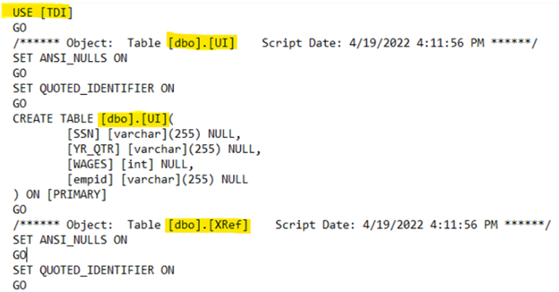

# Instructions for Creating an Analysis File with the Simulated TDC-UI Wage Data

### 1. Using the simulated TDC-UI wage datasets

If you’d like to run the code in this folder in your own SQL environment, the first step is to recreate the simulated datasets used in the Jupyter Notebook code programs. 01_create_simulated_data.sql is a SQL script that will automatically create the simulated TANF cross-reference data (named XRef) and UI wage data (named UI) in your SQL environment when run. It specifies all the data formatting needed so that your simulated data matches what the TDC-UI wage data team used in the programs. 

This SQL script assumes that you have a database called “TDI” in your SQL environment. It will save the datasets in the dbo schema of that TDI database, creating two tables called UI and XRef:

Once you’ve downloaded this SQL script in your environment, you can change these locations and names to whatever works in your environment. After tailoring these locations and names as needed, simply run the script and it will create the datasets. 
For instructions on how to download the repository files to modify and run the code, please see [01_using_the_tdc_ui_code](https://github.com/MDRCNY/TDC-UI/blob/main/00_how_to_use_this_repository/01_using_the_tdc_ui_code.md).

### 2. Running the Jupyter Notebook code programs

Once you have recreated the simulated data sets in your SQL environment using the 01_create_simulated_data.sql script, you will be able to run the Jupyter Notebook code files in this folder: 
  * [02_link_TANF_UI.ipynb](https://github.com/MDRCNY/TDC-UI/blob/main/03_create_analysis_file/02_link_TANF_UI.ipynb): this code program links the TANF cross-reference file with the UI wage data using SSN 
  * [03_restructure_person_quarter.ipynb](https://github.com/MDRCNY/TDC-UI/blob/main/03_create_analysis_file/03_restructure_person_quarter.ipynb): this code program creates your analysis file by summarizing the linked data to one record per person per quarter. This summarized data will be used to create outcomes in the repository folder that follows, called 04_create_outcomes.

To run these notebooks in your own environment, you will need to modify the SQL connection string at the top of each Jupyter Notebook, which currently reads **"mssql+pyodbc://@TDI"**. This DSN (Data Source Name) string provides the Python driver **(pyodbc)** needed to connect Python and SQL, and also provides information that is specific to the TDC-UI team’s environment, including the SQL Server (in the TDC-UI team’s case, **MSSQL**) and the database where the TDC-UI team’s data is stored **(TDI)**. Replace these string components with your own DSN connection information to route the Jupyter Notebook to your SQL server and database. 

### 3. Modifying the code for your work

If you apply this code to your own TANF or UI wage data for actual data processing, you will have to modify additional parts. For example, to demonstrate a processing step's output, our code will sometimes perform a step only on the first few records (for example, using a SELECT TOP 10 clause in the SQL statement). When processing your own data, use a CREATE TABLE or CREATE VIEW clause instead to create a new dataset complete with the processing changes.
